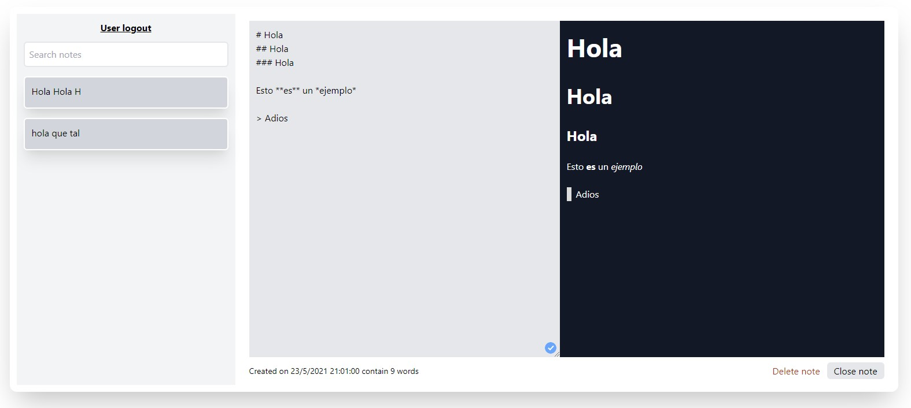

# **Vue Markdown Notes**

It is a personal note generator, which you can write directly in Markdown and it will be generated in Html ✍⚙️🗒.

## **Table of contents**

- [**Vue Markdown Notes**](#vue-markdown-notes)
    - [**Table of contents**](#table-of-contents)
    - [**General info**](#general-info)
    - [**Demo**](#demo)
    - [**Screenshots**](#screenshots)
    - [**Technologies**](#technologies)
    - [**Setup**](#setup)
    - [**Usage**](#usage)
    - [**Status**](#status)
    - [**Contact**](#contact)

## **General info**

**Date**: May, 2021  
**Duration**: 1 Week.

It's part of the course [EscuelaVue](https://escuelavue.es/).

## **Demo**

You can try it using the [Demo](https://vue-markdown-notes.netlify.app/)

## **Screenshots**

> <br><i>Desktop index</i>

> <br><i>Mobile index</i>

## **Technologies**

- [**Vue 3**](https://v3.vuejs.org/)
- [**Vuex 4**](https://next.vuex.vuejs.org/)
- [**Firebase**](https://firebase.google.com/)
  - [**Auth**](https://firebase.google.com/docs/auth)
  - [**Firestore**](https://firebase.google.com/docs/firestore)
- [**Tailwindcss**](https://tailwindcss.com/)

## **Setup**

1. Rename ".env.local.example" to ".env.local" and replace the values by your firebase configuration.

```console
VUE_APP_FIREBASE_API_KEY=YOUR_KEY
VUE_APP_FIREBASE_AUTH_DOMAIN=YOUR_AUTH_DOMAIN
VUE_APP_FIREBASE_PROJECT_ID=YOUR_PROJECT_ID
VUE_APP_FIREBASE_STORAGE_BUCKET=YOUR_STORAGE_BUCKET
VUE_APP_FIREBASE_MESSAGING_SENDER_ID=YOUR_MESSAGING_SENDER_ID
VUE_APP_FIREBASE_APP_ID=YOUR_APP_ID
```

2. Clone/Download the repository.

```console
git clone https://github.com/udsgit/vue-markdown-notes
```

3. You may have to install the packages with **NPM**.

```console
npm install
```

4. Serve to local.

```console
npm run serve
```

## **Usage**

1. Open the link from the [Demo](https://vue-markdown-notes.netlify.app/) or execute the serve with the steps above.
2. The app only works if you log in. By logging in you can create your own notes in Markdown, which will be saved and you can view them in Html. You can also filter, edit and delete them.

## **Status**

Project is: **_Completed._**

Since it has been part of a course, which has been completed.

## **Contact**

Created by [@Emmanuel](https://www.linkedin.com/in/emagleza/), feel free to contact me!

